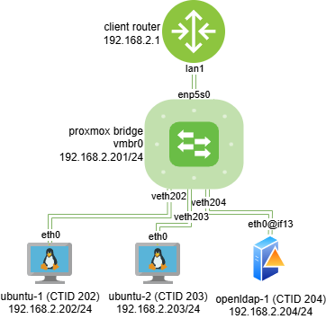

# Virtualization Labs
Creating a lab environment using Proxmox, Docker, and other tools for testing and exercising with virtual machines and containers.  

## Setup
I installed Proxmox VE 9 on my old gaming desktop using the [official Proxmox documentation][proxmox-install-docs] as a guide.  

### Desktop Hardware Specs
Motherboard: MSI Z97S SLI Krait Edition  
Processor: Intel(R) Core(TM) i5-4690K CPU @ 3.50GHz  
RAM: 8 GiB DIMM DDR3  
Storage: WDC WD10EZEX-60Z 1TB (931 GB usable)  
GPU: GeForce GTX 750 TI  

### Access
I am accessing the Proxmox VE web UI on my main desktop via Ethernet connections between the two desktops and an old router which is acting as a switch.  

## Objectives
Create several subnets that perform different network functions  

### Network Services Subnet
- [ ] Create a firewall container  
- [ ] Create a DNS container  
- [ ] Create a DHCP container  
- [ ] Create a domain controller container  

### Users/Clients Subnet
- [ ] Create several client machines that are able to communicate and access network services  

## Environment

### Machines

### Networking

#### Topology
  

#### IP Addressing

### Services

[paste links below here]: #

[proxmox-install-docs]: https://pve.proxmox.com/pve-docs/pve-admin-guide.html#chapter_installation  